# A. Convention Injection Contract

Status: agreed

## Scope

This document covers only the **SessionStart convention injection** path.

It does **not** cover:
- hit-based prompt guidance
- persisted `DirectiveType.HINT` lifecycle
- `UserPromptSubmit` injection

## Goal

Inject project-scoped convention guidance into a new agent session using a
single shared server-side logic path, while allowing each supported agent to
consume the injected content through its own hook output contract.

## Agreed Decisions

### 1. Source of truth for supported agents

- `config.toml` and init-installed state are the source of truth for what
  SecondSight is configured to support.
- If a user originally ran `secondsight init` only for Claude Code and later
  switches to Codex, that is a user action outside SecondSight's automatic
  responsibility.
- The user must explicitly run `secondsight init --agent codex` to install the
  Codex hook integration.
- Once hooks are installed correctly, the backend convention injection logic is
  shared.

Implication:
- Convention injection runtime does **not** try to dynamically infer or mutate
  supported-agent state at runtime.

### 2. Injection route shape

Convention injection uses a dedicated namespace, separate from observation
ingest.

- Ingest path:
  - `POST /hook/{agent}/{event_type}`
- Convention injection path:
  - `POST /hook/injection/session-start/{agent}`

Rationale:
- `session_start` is already used by ingest.
- Injection and ingest have different latency and response contracts.
- Keeping them in separate namespaces prevents route ambiguity and semantic
  drift.

### 3. Agent identity goes in the path, not the payload

`agent` is a routing discriminator, not ordinary business data.

Agreed shape:
- path param: `{agent}`
- request body: only session-start query inputs, such as `project_id`

Rejected alternative:
- passing `agent` in the JSON payload

Why rejected:
- creates mismatch risk between the actual hook caller and the declared target
  agent
- weakens the API contract
- pushes validation complexity into the request body instead of the route

### 4. What `/hook/injection/session-start/{agent}` fetches

The endpoint does **not** fetch raw directives for blind injection.

It fetches convention items that are:
- active
- eligible
- rankable
- inject-able

This means the injection path operates on convention candidates already
prepared by the directive layer, not on arbitrary rows from `directives`.

### 5. Budget handling split

Budget handling is split across two layers:

- Directive layer:
  - produces convention candidates
  - determines which outputs belong to convention injection
- Injection path:
  - performs final budget fit for the current injection request

Agreed reason:
- budget is injection-time concern, not purely analysis-time concern
- different agents may have different output overhead
- the convention wrapper/template itself consumes prompt budget

Therefore:
- candidate preparation is persistent/systemic
- final budget fit is runtime/request-scoped

### 6. Convention injection uses a template

Convention items are not injected as raw bullet text with no framing.

The injection path must wrap them in an explicit convention template that tells
the LLM what these items are and how to interpret them.

Reason:
- this is system-prompt guidance, not a raw data dump
- the model must be told that the injected content is project-derived
  behavioral guidance

Non-goal:
- hit-based guidance does not inherit this template automatically

### 7. Shell script responsibility stays thin

The SessionStart shell hook should do only these things:

1. receive the agent hook stdin payload
2. derive or pass through `project_id`
3. call `POST /hook/injection/session-start/{agent}`
4. emit the returned response body to stdout unchanged
5. separately send the observation ingest event

The shell hook should **not** do:
- convention ranking
- budget selection
- template assembly
- agent semantic branching on convention contents
- directive classification

### 8. Server + adapter own rendering

Responsibility split:

- Server-side injection route owns:
  - convention item fetch
  - final budget fit
  - convention template assembly
- Adapter owns:
  - agent-specific final hook output rendering

This means the adapter contract must extend beyond:
- `inject_convention() -> str`

It must also support final SessionStart output rendering for each agent.

### 9. Response body is raw hook stdout payload

Agreed contract:
- response body from `POST /hook/injection/session-start/{agent}` is the exact
  payload the shell hook should print to stdout

Examples:
- Claude Code:
  - final JSON payload shaped for `hookSpecificOutput.additionalContext`
- Codex:
  - final JSON payload shaped for top-level `systemMessage`

Rejected alternative:
- wrapping the response in a server envelope such as
  `{stdout_payload, count, budget_used, ...}`

Why rejected:
- makes the shell hook parse and unwrap server JSON
- thickens the shell layer
- introduces extra escaping and malformed-payload failure modes

Observability should instead live in:
- server logs
- metrics
- optional debug instrumentation

### 10. Agent-specific evidence currently accepted

Current grounded evidence for SessionStart injection:

- Claude Code:
  - consumes structured hook output via `hookSpecificOutput.additionalContext`
  - supported by local transcript evidence
- Codex:
  - convention injection should use top-level `systemMessage`
  - this matches the session-scoped nature of convention guidance
  - see [.codex/hooks/samsara-session-start.sh](.codex/hooks/samsara-session-start.sh)

Boundary:
- these are SessionStart-specific conclusions
- they must not be automatically generalized to `UserPromptSubmit` or other
  hook events
- event-scoped hit guidance may use a different output shape for the same
  agent; that belongs to the B contract, not this one

## Data Flow

```dot
digraph ConventionInjection {
  rankdir=LR;
  node [shape=box];

  analysis [label="Analysis Layer"];
  directive [label="Directive Layer\nproduce convention candidates"];
  store [label="stored convention items\n(active / eligible / rankable / inject-able)"];

  init [label="secondsight init\nagent install + config state"];
  config [label="config.toml / state\nsingle source of truth"];

  agent [label="Coding Agent"];
  hook [label="SessionStart hook script"];
  stdin [label="stdin payload\n(cwd, session_id, ...)"];
  project [label="resolve project_id"];

  sync_api [label="POST /hook/injection/session-start/{agent}\n(project_id)"];
  fetch [label="fetch active convention items"];
  budget [label="apply injection-time budget"];
  template [label="wrap with convention template"];
  render [label="agent-specific render\nClaude: additionalContext\nCodex: systemMessage"];

  stdout [label="hook stdout"];
  inject [label="agent consumes injected context"];

  ingest [label="POST /hook/{agent}/session_start\n(async observation ingest)"];

  analysis -> directive -> store;
  init -> config;

  agent -> hook;
  stdin -> hook -> project -> sync_api;
  config -> sync_api [style=dashed, label="installed/expected agent support"];

  sync_api -> fetch -> budget -> template -> render;
  store -> fetch;

  render -> hook -> stdout -> inject;
  hook -> ingest [style=dashed];
}
```

## Open Items That Are Explicitly Deferred

- exact adapter method name for final SessionStart rendering
- exact request/response schema types in Python
- no-convention response semantics (`204` vs empty valid payload)
- `UserPromptSubmit` injection contract
- persisted hints vs runtime-only prompt guidance
