# B. Hit-Based Guidance Contract

Status: core direction agreed

## Scope

This document covers only the **UserPromptSubmit hit-based guidance** path.

It does **not** cover:
- SessionStart convention injection
- persisted `DirectiveType.HINT` lifecycle design
- exact hit categories, signals, or false-positive guardrails

## Goal

Inject prompt-quality guidance only when a user prompt is semantically vague
enough to justify intervention, while keeping the sync hook path lightweight,
agent-agnostic in semantics, and agent-specific only at final output render.

## Agreed Decisions

### 1. Intervention point is `UserPromptSubmit`

Hit-based guidance is a pre-execution runtime path.

Agreed trigger:
- `UserPromptSubmit`

Reason:
- this is the last point where SecondSight can help improve the user request
  before the coding agent starts acting on a potentially ambiguous instruction
- the trigger is conceptually shared across supported coding agents

### 2. Rarely intervene

The default behavior is pass-through.

Guidance should be injected only when the user prompt is semantically vague
enough that proceeding immediately would likely force the agent to guess.

Implication:
- no always-on prompt wrapper
- no unconditional prompt coaching
- no habit of interrupting already-clear requests

### 3. Borrow the flow pattern from `claude-code-prompt-improver`

Accepted ideas from the reference project:
- intervention timing at `UserPromptSubmit`
- lightweight synchronous hook path
- explicit bias toward rare intervention

Rejected direct carry-over:
- delegating the actual hit decision to the coding agent itself

Reason:
- SecondSight must support multiple agents
- agent self-evaluation would make hit behavior inconsistent across agents
- agent self-evaluation is hard to regression test and hard to explain

### 4. Borrow the rule dimensions from `andrej-karpathy-skills`

Accepted ideas from the reference project:
- surface ambiguity before implementation
- avoid hidden assumptions
- ask for clarification before acting when multiple interpretations exist
- define success criteria instead of proceeding on vague goals

These principles are treated as the conceptual source for deterministic
prompt-quality checks, not as a literal runtime prompt template.

### 5. B uses a mixed design, not a single-reference clone

Agreed design split:

- `claude-code-prompt-improver` contributes:
  - hook timing
  - low-overhead sync path
  - `rarely intervene` philosophy
- `andrej-karpathy-skills` contributes:
  - prompt ambiguity dimensions
  - clarification-before-execution principles
  - success-criteria awareness
- SecondSight contributes:
  - an owned evaluator contract
  - shared hit semantics across agents
  - testable guidance categories

Therefore:
- B is not a clone of either reference project
- B is a SecondSight-native runtime contract informed by both

### 6. Hit decision belongs to a SecondSight-owned evaluator

The hit/miss decision should be made by SecondSight, not delegated to the
coding agent.

Agreed shape:
- input: current user prompt plus request context such as `project_id`
- evaluator: a SecondSight-defined wrapped prompt and output schema
- output: hit guidance or empty output

Reason:
- keeps behavior consistent across Claude / Codex / future agents
- keeps tests stable
- keeps the sync path controllable
- gives SecondSight an explainable and controllable policy surface

This means:
- the evaluator may use an LLM for ambiguity classification
- but the classification contract is still owned by SecondSight
- the coding agent itself does not decide whether to intervene

### 7. B v1 is runtime-only first

For the first version, hit-based guidance should be treated as a runtime path,
not a persisted directive lifecycle.

Meaning:
- do not require every hit guidance to be stored in DB
- do not require `DirectiveType.HINT` to be the primary execution path
- do not require a write-then-read persistence round-trip on each prompt

Reason:
- `UserPromptSubmit` is a high-frequency synchronous path
- prompt-quality evaluation is request-scoped and latency-sensitive
- persisting too early would lock the design before the evaluator is proven

### 8. Guidance semantics are shared; rendering is agent-specific

The semantics of a hit should be owned by shared server-side logic.

The adapter layer should own only the final hook output shape for each agent.

Implication:
- evaluator logic should not depend on Claude-specific or Codex-specific
  output contracts
- adapters may differ in how the guidance is emitted
- the meaning of a hit should remain stable across agents

For Codex specifically:
- hit guidance is event-scoped
- therefore it should be modeled as hook event output, not as session-level
  `systemMessage`
- this distinguishes B from SessionStart convention injection in A

### 9. B uses LLM-based ambiguity classification, but not agent self-evaluation

The first version should use an LLM to classify prompt ambiguity, because this
kind of semantic judgment is poorly served by a pure score-based rule engine.

Accepted v1 approach:
- bypass and hard escapes remain deterministic
- ambiguity classification is LLM-based
- the wrapped evaluator prompt and output schema are owned by SecondSight
- final guidance wording is still rendered from fixed templates

Rejected alternatives:
- pure regex / score-only prompt ambiguity detection
- agent self-evaluation in the style of `claude-code-prompt-improver`

Reason:
- pure scoring is brittle and expensive to maintain as features evolve
- agent self-evaluation makes behavior vary by coding agent and model
- a SecondSight-owned evaluator keeps the system AI-native without giving up
  contract control

### 10. Bypass is agent-scoped and runs before the evaluator

Hit-based guidance must support agent-specific command and escape patterns.

Examples:
- Claude Code may treat prefixes such as `*`, `/`, `#` as special
- Codex may use a different set such as `/` or `$`
- future agents may define other prompt prefixes or command markers

Agreed consequence:
- bypass detection is a separate stage that runs before prompt-quality
  evaluation
- if bypass matches, SecondSight returns empty guidance and does not run the
  semantic evaluator

This keeps:
- command syntax handling separate from prompt ambiguity handling
- the evaluator focused on semantic vagueness only
- shell scripts free of agent-specific prompt syntax logic

### 11. Bypass rules belong in an agent-scoped registry, not in the shell script

Bypass patterns should be represented as agent-specific capability data.

Accepted direction:
- maintain a bypass dictionary / mapping table keyed by agent
- evaluate bypass through shared runtime logic using that agent-scoped mapping

Rejected direction:
- hardcoding slash/prefix handling separately inside each shell hook
- embedding bypass conditions directly into the semantic evaluator

Reason:
- different agents use different command grammars
- future agent support should extend a registry, not fork the runtime path
- shared tests can validate bypass behavior independently from semantic hits

### 12. Bypass behavior may differ by pattern

Bypass is not always a uniform "return the original prompt unchanged" contract.

Some patterns may:
- preserve the original prompt as-is
- strip an explicit escape prefix before continuing agent execution
- skip only hit-based guidance while still allowing observation ingest

Therefore the bypass registry should be able to express:
- match pattern
- bypass reason
- whether the raw prompt is preserved or normalized

This is still an agent capability concern, not shell script business logic.

### 13. B v1 keeps only a minimal internal classification schema

The first version should keep the evaluator output schema as small as possible.

Agreed minimal internal schema:

```json
{
  "decision": "pass | intervene",
  "primary_category": "missing_target | multiple_interpretations | missing_scope | missing_success_criteria"
}
```

Rejected for v1:
- `confidence`
- `secondary_categories`
- free-form long explanations
- direct evaluator-authored final guidance text

Reason:
- these fields add ambiguity without improving the core intervention decision
- they make the sync path heavier
- they complicate renderer behavior without clear value in v1

### 14. `primary_category` remains internal but is still required

The category does not need to be exposed to the user or the coding agent.

It remains necessary inside SecondSight for:
- stable template mapping
- regression testing
- observability and frequency analysis
- future refinement of intervention behavior

Therefore:
- `primary_category` is an internal taxonomy key
- it is not part of the user-facing guidance contract

### 15. Agent-facing guidance is rendered from fixed templates

The LLM evaluator should classify.
SecondSight should render the final guidance text.

Agreed v1 mapping:

- `missing_target`
  - `Clarify which file, module, error, or workflow this request refers to before acting.`
- `multiple_interpretations`
  - `Clarify the intended outcome or approach before acting, since this request could be interpreted in multiple valid ways.`
- `missing_scope`
  - `Clarify the intended scope before acting, such as analysis only, code changes, tests, or refactoring.`
- `missing_success_criteria`
  - `Clarify what outcome should count as complete before acting, including how success should be verified.`

Reason:
- keeps user-facing guidance short and consistent
- avoids exposing internal evaluator reasoning
- separates semantic classification from product wording

### 16. Final guidance should stay short and single-purpose

For v1, agent-facing prompt guidance should:
- be a single short sentence
- focus on one primary gap
- avoid exposing internal taxonomy names
- avoid long explanations or question lists

This preserves the `rarely intervene` goal by minimizing disruption in the
`UserPromptSubmit` path.

### 17. Evaluator wrapped prompt should be a classifier prompt, not a behavior prompt

The evaluator prompt should borrow the philosophy of
`reference_opensoure/claude-code-prompt-improver`, but it should not ask the
model to decide downstream behavior in the style of "invoke skill if vague."

Instead, it should function as a strict JSON classifier owned by SecondSight.

Required properties:
- trust user intent by default
- intervene only when genuinely unclear
- if uncertain, choose `pass`
- do not rewrite the prompt
- do not ask questions
- do not produce user-facing guidance text
- return JSON only

### 18. Evaluator wrapped prompt draft

Draft v1 classifier prompt:

```text
You are a prompt ambiguity classifier for a coding-agent workflow.

Your job is to decide whether the user prompt is clear enough to execute
immediately, or whether it is ambiguous enough that a short clarification
guidance should be injected before execution.

Classify conservatively.
Trust user intent by default.
Intervene only when the prompt is genuinely unclear.
If you are unsure, choose pass.

Allowed categories:

1. missing_target
The prompt specifies an action but does not identify a concrete target such as
a file, module, error, workflow, endpoint, or behavior.

2. multiple_interpretations
The prompt can reasonably mean multiple different things, and proceeding would
require guessing which one the user wants.

3. missing_scope
The prompt identifies a target or task, but does not define the intended
execution boundaries, such as analysis only, code changes, tests, refactoring,
or docs.

4. missing_success_criteria
The prompt asks for work but does not define what outcome should count as
complete or how success should be verified.

Return JSON only.
Do not rewrite the prompt.
Do not ask questions.
Do not produce user-facing guidance text.
Do not explain your reasoning.

Output schema:
{
  "decision": "pass" | "intervene",
  "primary_category": "missing_target" | "multiple_interpretations" | "missing_scope" | "missing_success_criteria" | null
}

Choose "pass" if the prompt is actionable enough to proceed without likely
guessing.

User prompt:
{{prompt}}
```

### 19. Few-shot examples are optional and should stay minimal

If few-shot examples are added, they should stay short and low-count to avoid
inflating the synchronous `UserPromptSubmit` path.

Representative examples that may be used:
- `fix it` -> `intervene`, `missing_target`
- `fix session invalidation after password change` -> `pass`
- `make search faster` -> `intervene`, `multiple_interpretations`
- `refactor auth` -> `intervene`, `missing_scope`

Non-goal:
- building a large prompt library into the runtime evaluator prompt

## Data Flow

```dot
digraph HitBasedGuidance {
  rankdir=LR;
  node [shape=box];

  agent [label="Coding Agent"];
  hook [label="UserPromptSubmit hook script"];
  stdin [label="stdin payload\n(user prompt, cwd, session_id, ...)"];
  project [label="resolve project_id"];

  sync_api [label="POST /hook/injection/user-prompt/{agent}"];
  input [label="runtime input\nproject_id + current user prompt"];

  bypass [label="agent-scoped bypass matcher"];
  evaluator [label="SecondSight-owned\nLLM ambiguity evaluator"];
  context [label="project/runtime context\n(optional)"];
  result [label="decision + primary_category"];

  render [label="agent-specific render\n(if needed by agent contract)"];
  stdout [label="hook stdout"];
  inject [label="agent consumes hit-based guidance"];

  ingest [label="POST /hook/{agent}/user_prompt\n(async observation ingest)"];

  agent -> hook;
  stdin -> hook -> project -> sync_api;
  sync_api -> input -> bypass;
  bypass -> evaluator [label="no bypass"];
  context -> evaluator;
  evaluator -> result -> render;
  render -> hook -> stdout -> inject;

  hook -> ingest [style=dashed];
}
```



## Open Items That Are Explicitly Deferred

- exact rule signals per category
- exact bypass registry schema and storage location
- false-positive guardrails
- request/response schema for `POST /hook/injection/user-prompt/{agent}`
- how much project-level context the evaluator may consult
- whether any runtime guidance should later graduate into persisted hints
