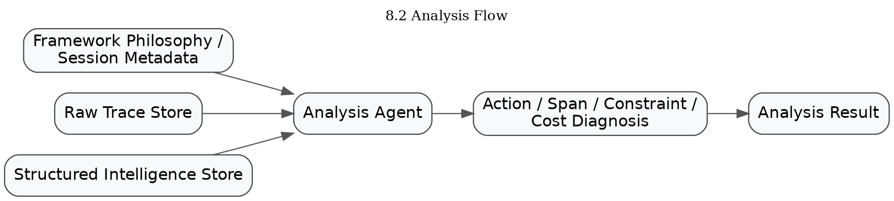
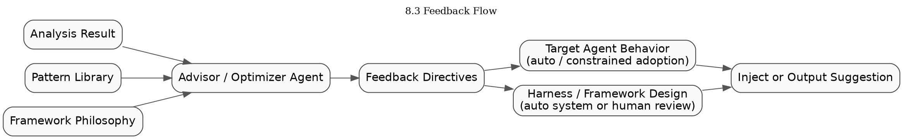
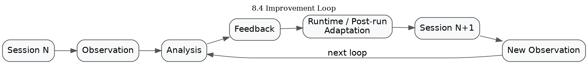

# SecondSight 產品需求文件 (PRD)
**版本**：1.3
**日期**：2026 年 4 月 20 日
**狀態**：Draft
---------------------------

## 一、Executive Summary
SecondSight 是一個面向 AI Agent 的 execution intelligence 與 self-optimization 系統。它觀察 coding agent 的執行行為，分析行為效率、任務對齊度與 framework 實踐情況，並產出可被 agent 與其所屬 harness / framework 採納的改善指令，讓 agent 系統具備持續自我改善的能力。
**核心理念**：SecondSight 的第一使用者不是人，而是 Agent；但其優化對象不只包含 agent 行為，也包含 agent 所運行的 harness / framework 設計。
SecondSight 的目標不是教人如何寫 prompt、調 hook、配 workflow，而是建立一個能對 agent execution 做觀測、診斷、回饋與優化的 intelligence layer。
**AI Native 定義**：SecondSight 所謂的 AI Native，不是指「產品用 AI 寫出來」，而是指：當核心 LLM 能力上升時，SecondSight 的診斷、建議、模式發現與優化品質也會同步提升。若核心模型變強，而產品本身無法一起變強，反而需要大量人工規則來限制與修補，那它就不是 AI Native 產品，而只是把更強的智能困在舊的框架裡。
**產品判準**：SecondSight 的價值不在於替代模型本身，而在於把 execution traces 轉化為可作用的 intelligence，讓 agent system 具備更強的可觀測性、可診斷性、可治理性與可優化性。

## 二、問題陳述
### 2.1 現狀痛點
當前的 coding agent（Claude Code、Codex、Gemini CLI、[OpenCode](https://github.com/anomalyco/opencode) 等，以及建立在其上的 agent frameworks）存在以下問題：

**對終端使用者與團隊而言**
- Agent 執行過程不透明，不清楚它實際做了哪些動作
- 難以判斷 agent 是否遵循使用者指令、framework 設計原則與任務邊界
- Token、工具呼叫、搜尋、驗證與重試的成本不可預測
- 當 agent 效能不佳時，很難分辨問題來自 model、agent 行為，還是 framework 設計
**對 Agent 與 Harness 本身而言**
- Agent 缺乏 execution-level self-critique 能力，無法穩定辨識自己的浪費、偏離或策略錯誤
- Harness / framework 在設計上通常有既定哲學與約束，但 agent 本身無法判斷自己的改善是否違反原始設計精神
- 缺乏從歷史執行 traces 中提取 diagnosis 並轉成 policy / strategy adjustment 的閉環
- 缺乏跨 session、跨任務、跨 framework 的優化累積能力

### 2.2 核心產品問題
SecondSight 要解決的不是單一模型能力不足，而是以下結構性問題：
1. **可觀測性不足**：Agent 的行為黑盒化，無法有效審視
2. **可診斷性不足**：即使拿到 traces，也缺乏系統化判斷哪些動作有效、哪些浪費
3. **可優化性不足**：缺少將 analysis 結果轉成 agent 行為與 harness 設計改進的機制
4. **設計精神流失**：在缺乏 framework 設計脈絡的情況下，任何優化都可能變成偏離原本理念的局部改寫
5. **改善無法累積**：一次 session 的經驗，無法穩定轉化成下一次 execution 的能力提升

### 2.3 市場假設與產品定位
SecondSight 的產品定位建立在以下市場假設上：
- LLM 市場將長期存在能力、價格、延遲、可用性與授權方式的分層
- 並非所有使用者、團隊或 agent system 都能持續使用最頂級模型
- 對多數實際部署環境而言，「如何讓可用模型在既有成本與 framework 約束下做到更高 execution quality」會是長期問題
- 隨著 agent frameworks 百花齊放，市場對 cross-agent、cross-framework 的 observability 與 optimization layer 需求會上升
**SecondSight 的定位**：
- 短中期：幫助可用模型發揮超出其價格與預設 harness 的 execution 表現
- 長期：成為 agent systems 的 execution intelligence、optimization 與 governance layer
SecondSight 不把自身價值綁定在「只有中階模型才需要優化」這種單一敘事上；它更根本地面向任何需要觀測、診斷、治理與持續優化 agent execution 的場景。

## 三、產品願景
### 3.1 短期願景（1-2 年）
建立 agent execution 的觀測與診斷能力，降低浪費、提高對齊度，並形成可採納的優化建議。

### 3.2 中期願景（2-4 年）
讓 agent 與其 framework 能透過歷史執行資料持續改善，在不同模型能力、任務條件與 framework 限制下穩定提升 execution quality。

### 3.3 長期願景（4 年以上）
成為 autonomous agents 的 execution intelligence 與 trust layer，支撐 agent 自主行為的可觀測、可診斷、可治理與可優化。

## 四、產品原則
### 4.1 AI Native
SecondSight 本身會隨著 LLM 能力提升而變強。
- Analysis Agent 的診斷能力取決於底層 model 的 reasoning 與 judgment
- Advisor / Optimizer Agent 的建議品質取決於底層 model 的策略理解與反思能力
- Pattern discovery 不應主要依賴人工硬編碼規則，而應盡量讓 AI 從 traces 中發現低效模式與改善機會
**核心判準**：
- 若核心模型升級，SecondSight 的 diagnosis quality、directive quality、pattern discovery quality 應同步提升
- 若產品必須大量依賴人工規則來限制更強模型的發展，則代表其 AI Native 程度不足

### 4.2 Agent-First
產品的第一使用者是 Agent。所有核心輸出都應可被 agent 消化、判讀與採納，而不只是供人閱讀的報表。
**輸出分層**：
- **Agent 行為調整**：Directive 格式設計為 agent 可直接理解並採納
- **Harness 設計建議**：結構化輸出，可供自動化系統處理，或由 framework 維護者審閱後採納
兩類輸出都以機器可讀為優先，人類可讀為次要。

### 4.3 Online Continuous Learning
SecondSight 不是離線優化後部署的系統，而是持續學習、即時適應的系統。
- 每個 session 都可以成為新的經驗來源
- 每次 diagnosis 都可能形成新的 directive 或 policy adjustment
- 每次 directive 的採納結果都應反饋回系統，成為後續優化依據

### 4.4 Optimization over Logging
SecondSight 不是單純的 log storage 或 chat history archive，而是將執行資料轉成可操作的優化訊號。

### 4.5 Respect Framework Philosophy
優化不能脫離 agent framework 原本的設計精神。SecondSight 在提出建議前，必須先理解該 framework 的理念、策略偏好與約束，避免生成違反原意的改善方案。

### 4.6 Preserve Raw Evidence
不過早壓縮 feedback。保留完整 execution traces，讓分析與優化 agent 能基於原始證據自行判斷問題。

### 4.7 Dual-Loop Improvement
同時支援：
- **Runtime feedback**：在執行過程中提供局部修正
- **Post-run optimization**：在 session 結束後做策略、policy、framework 級別改善

### 4.8 Bounded Autonomy
SecondSight 的目標是讓 agent system 更自主地改善自己，而不是讓人工規則永遠主導優化方向；但任何自主優化都必須具備邊界。
- 高風險 directive 必須可被限制、回滾或人工審閱
- 自動採納應優先作用於低風險、高可驗證的行為調整
- framework / policy 級變更應有更高的採納門檻與觀測機制

### 4.9 Safety before Optimization
任何 feedback 都可能造成副作用。SecondSight 的優化必須考慮 overcorrection、局部最優、與全域任務品質下降的風險。

## 五、目標用戶
### 5.1 主要用戶：Agent 與其 Harness / Framework
SecondSight 的核心使用對象包含兩個層面：
**A. Agent**
被觀測、被診斷、被給予回饋的執行主體。
**B. Agent Harness / Framework**
承載 agent 運作邏輯的外部設計層，包括：
- prompt scaffold
- workflow orchestration
- skill routing
- hook policies
- sub-agent topology
- context management strategy
SecondSight 的優化不只面向 agent 的行為，也面向 framework 的設計調整。

### 5.2 次要用戶：Agent 的操作者與 framework 維護者
他們關心：
- Agent 執行效率
- Token 與工具成本
- 任務成功率
- Framework 是否被正確實踐
- 優化建議是否符合原有設計理念
- Agent 自主優化是否可治理、可追責、可回滾

## 六、產品架構
SecondSight 由三個核心支柱組成：Observation、Analysis、Feedback。三者形成完整的優化閉環，並同時作用於 agent 行為與 harness 設計。

### 6.1 支柱一：Observation（觀察層）
**職責**：記錄 agent execution 的原始事實
**輸入來源**：
- Agent 的 tool calls（讀檔、寫檔、執行指令、搜尋等）
- User prompts
- Tool 執行結果
- Session 生命週期事件
- 可取得的 token、latency、cost signals
- Framework metadata（若可用）
**輸出**：
- 結構化 tool event 記錄
- 原始 execution traces
- Token / latency / cost attribution signals
- Session metadata
- Framework context metadata
**設計要點**：
- Multi-agent adapter layer 支援不同 agent 的資料格式
- 保留 raw event stream，不做早期摘要
- 採用 durable queue / claim-confirm pattern 避免資料遺失
- 優先記錄可追責、可回放、可供 diagnosis 的證據

### 6.2 支柱二：Analysis（分析層）
**職責**：診斷 agent 行為與 framework 實踐的有效性
**輸入**：
- Observation 層的 raw traces
- Framework philosophy / design context
- 歷史 feedback 與 outcomes

**分析維度**：
**A. Action Classification**
- Aligned：符合目標與設計精神
- Wasteful：多餘、重複、資訊增益低
- Divergent：偏離任務或違反限制
- Exploratory：合理探索，但需有邊界
- Premature：證據不足即過早下結論或修改
- Over-verified：過度驗證已足夠確定的事項
**B. Constraint & Intent Adherence**
- 是否遵循 user constraints
- 是否違反 framework 的設計原則
- 是否偏離 session 任務目標
- 是否執行了不必要的越權動作
**C. Span / Episode Analysis**
不只分析單一 tool event，而是將多個事件聚合成有意義的執行片段，例如：
- investigation span
- implementation span
- verification span
- wandering span
- recovery span
**D. Cost Attribution**
- 每個 action / span 的 token 消耗
- Wasteful 行為對總成本的貢獻
- 可節省成本估算
- 成本與成功率之間的關係
**E. Pattern Detection**
- 重複讀取同一檔案
- 過度搜尋後才開始行動
- 反覆驗證已確認事項
- 在 evidence 不足時直接 patch
- 多次重試同類命令但沒有新資訊增益
**輸出**：
- 結構化診斷結果（JSON）
- Action-level judgments
- Span-level diagnosis
- Constraint adherence report
- Cost / waste metrics
- Framework alignment notes
**設計要點**：
- Analysis Agent 主動決定查詢哪些 traces
- 優先聚焦高信心、可驗證的模式
- diagnosis 不只面向 agent 行為，也面向 framework 落地情況
- 分析時必須納入 framework philosophy 作為判準的一部分

### 6.3 支柱三：Feedback（回饋層）
**職責**：將 diagnosis 轉成可被 agent 與 framework 採納的改善指令或優化建議
**輸入**：
- Analysis 結果
- Pattern library
- Framework philosophy / constraints
- 過去 directive 的採納與成效
**輸出類型**：
**A. Runtime Feedback**
在執行中介入：
- 提醒重複動作
- 阻止偏離任務
- 建議先驗證再修改
- 提示切換更適合的策略
**B. Post-run Critique**
在 session 結束後形成可累積的反思：
- 本次主要浪費點
- 偏離來源
- 可改善的 decision pattern
- 未來同類任務的建議策略
**C. Policy / Harness Optimization**
面向 framework / harness 設計的建議：
- prompt scaffold 調整
- hook policy 調整
- skill / sub-agent routing 建議
- workflow sequencing 優化
- 防止特定 waste pattern 的 guardrails
**Injection / Delivery 機制**：
- Session-start injection
- Per-action / runtime injection
- Post-run directive store
- Harness maintainer review channel（供 framework 維護者採納）
**設計要點**：
- Feedback 不只是建議，而是可追蹤效果的 directive
- 每個 directive 必須有 scope、trigger、priority、expected effect
- feedback 需受 framework philosophy 約束
- 支援 runtime 與 post-run 雙模式
- 採納方式需依風險與作用範圍分級

## 七、Framework Philosophy Layer
### 7.1 問題
不同 agent frameworks 各自有不同設計哲學。若 SecondSight 不理解 framework 原意，就可能提出表面上有效、實際上破壞設計精神的建議。

### 7.2 目標
在給出優化建議前，SecondSight 應先建立該 framework 的設計脈絡，包括：
- 目標任務類型
- 允許的探索風格
- 成本與成功率的優先順序
- 對 verification / planning / autonomy 的偏好
- 既有 guardrails 與禁止事項

### 7.3 Framework Profile 最小必要欄位
當 framework 沒有完整文件化的 philosophy 時，SecondSight 要求提供以下最小必要輸入：
| 欄位 | 說明 | 範例值 |
|---|---|---|
| task_orientation | 主要任務類型 | debugging / feature_dev / refactor / exploration |
| exploration_tolerance | 探索容忍度 | conservative / balanced / aggressive |
| cost_sensitivity | 成本敏感度 | high / medium / low |
| verification_preference | 驗證偏好 | minimal / evidence_based / thorough |
| autonomy_level | 自主程度 | supervised / semi_autonomous / fully_autonomous |
| prohibited_actions | 禁止事項 | 不得自動刪除檔案、不得修改 config 等 |
| success_criteria | 成功判定標準 | task_completion / user_satisfaction / both |

### 7.4 作用
Framework Philosophy Layer 作為 Analysis 與 Feedback 的上層約束，使優化建議不會脫離原本系統設計。
未來可逐步發展自動抽取能力，從 framework 的 prompt、hook 設計、歷史執行模式中推斷其 philosophy。

## 八、資料流設計
### 8.1 寫入流程（Observation）

```dot
digraph Observation_Flow {
  rankdir=LR;
  splines=true;
  fontsize=12;
  labelloc="t";
  label="8.1 Observation Flow";

  node [shape=box, style="rounded,filled", fillcolor="#F8F9FA", color="#444444", fontname="Helvetica"];
  edge [color="#555555", fontname="Helvetica"];

  event [label="Agent executes\nTool / Prompt / Session Event"];
  hook [label="Hook / Adapter\ncaptures event"];
  normalize [label="Normalize format +\nmetadata enrich"];
  queue [label="Durable Queue\n(claim-confirm)"];
  rawstore [label="Raw Trace Store"];
  structured [label="Structured Intelligence Store"];

  event -> hook;
  hook -> normalize;
  normalize -> queue;
  queue -> rawstore;
  rawstore -> structured [label="sync update"];
}
```


### 8.2 分析流程（Analysis）


### 8.3 回饋流程（Feedback）


### 8.4 循環閉合


## 九、資料儲存設計
### 9.1 設計原則
SecondSight 採用雙層儲存：

1. Raw Trace Layer：保留完整 execution evidence
2. Structured Intelligence Layer：支撐 diagnosis、aggregation、pattern reuse、directive evaluation

### 9.2 Raw Trace Layer
建議採 filesystem / object-like 結構，利於 agent 使用標準工具操作與檢查。

目錄示意
```
/secondsight/
  /sessions/
    /{session_id}/
      /events/
        {timestamp}_{event_type}.json
      /metadata.json
      /framework_context.json
```

### 9.3 Structured Intelligence Layer

建議使用可索引的結構化 store（如 SQLite），至少包含：

* runtime_events
* behavior_spans
* analysis_results
* constraint_violations
* directives
* directive_outcomes
* pattern_library
* framework_profiles

### 9.4 查詢方式

* Agent 可直接對 raw trace layer 使用 ls / grep / cat
* 系統內部 analysis / aggregation 使用 structured store 做快速檢索與統計
* 不將 filesystem-only 視為唯一資料面


## 10. Feedback Directive Contract（初版）
### 10.1 設計目的

Directive 是 SecondSight 的核心輸出單位，必須可追蹤、可作用、可評估成效。

10.2 初版欄位
```JSON
{
  "directive_id": "d_001",
  "scope": "debugging",
  "target": "agent_behavior",
  "adoption_mode": "auto",
  "trigger": "repeat_read_same_file > 2",
  "instruction": "Before rereading the same file, verify whether the needed evidence is already in context.",
  "priority": "high",
  "mode": "runtime",
  "expected_effect": "reduce redundant file reads",
  "framework_constraint": "must preserve evidence-first debugging philosophy",
  "source_analysis_id": "a_003",
  "expiry": "2026-05-31"
}
```

# 10.3 Adoption Mode 說明

| Target | Adoption Mode | 行為說明 |
| --- | --- | --- |
| agent_behavior | auto | Agent 直接採納，適用低風險且可驗證的調整 |
| agent_behavior | review_required | 高風險調整，需額外確認 |
| harness_design | auto | 自動化系統可直接套用，僅限低風險變更 |
| harness_design | review_required | 需 framework 維護者審閱後採納 |

### 10.4 後續需釐清的問題
* directive 是 advisory 還是 binding
* conflict resolution 機制
* adoption / rejection 的回報格式
* directive 的作用範圍與 TTL
* directive 成效如何歸因
* rollback / disable 機制如何定義

## 11. 開發階段規劃

Phase 1：Observation Layer

目標：建立 multi-agent execution 記錄系統

範圍：

* Claude Code adapter
* Codex CLI adapter
* Gemini CLI adapter
* OpenCode CLI adapter
* Raw trace store
* Durable queue
* Token / cost / latency signals
* 基本 framework metadata capture

驗收標準：

* 能完整記錄三種 agent 的 session
* 原始 traces 可被查詢
* 無資料遺失
* 支援最小可用的 framework context 記錄


## Phase 2：Analysis Layer

目標：建立 execution diagnosis 系統

範圍：

* Analysis Agent
* Action classification
* Constraint adherence
* Span / episode grouping
* Cost attribution
* 高信心 pattern detection
* Structured output format
* Framework philosophy integration

驗收標準：

* 能自主查詢 traces
* 能正確識別預定義 waste patterns
* 能輸出 span-level diagnosis
* 能納入 framework philosophy 作為判斷依據

## Phase 3：Feedback Layer

目標：讓 diagnosis 可轉為 agent / harness 的改善機制

範圍：

* Advisor / Optimizer Agent
* Directive contract
* Runtime injection
* Post-run directive generation
* Harness optimization suggestion channel
* Directive outcome tracking
* Adoption mode routing

驗收標準：

* 能生成高可採納性的 directives
* Target Agent 行為出現可觀察改變
* Harness / framework 維護者可理解並評估建議
* 改變整體上是正向而非局部最優

## 12. 成功指標

### 12.1 Phase 1 指標

| 指標 | 目標 |
|------|------|
| 資料完整性 | 100% 可觀測 events 被記錄 |
| 支援 agent 數 | 3 種 |
| Trace 可查詢性 | 單一 session 檢索延遲可接受 |

### 12.2 Phase 2 指標

| 指標 | 目標 |
|------|------|
| 高信心 waste pattern 偵測準確率 | > 80% |
| 誤判率 | < 10% |
| Constraint adherence 判斷可重現 | 是 |
| Span-level diagnosis 可穩定輸出 | 是 |

### 12.3 Phase 3 指標

| 指標 | 目標 |
|------|------|
| Directive adoption rate | 可測量 |
| Directive adoption precision | 可測量 |
| 行為改變率 | > 50% |
| Efficiency 提升 | token / unnecessary actions 下降 > 15% |
| Success rate | 不下降或提升 |
| Regression rate after feedback | < 5% |

### 12.4 長期指標

| 指標 | 目標 |
|------|------|
| Self-improvement loop | agent 效率隨 session 增加而提升 |
| Cross-task generalization | 某類 directive 在相近任務可復用 |
| Cross-agent / cross-framework transfer | 部分 pattern 可遷移 |
| Model upgrade benefit | 底層模型升級後 diagnosis 與 directives 品質同步提升 |

## 13. 風險評估

### 13.1 技術風險

| 風險 | 影響 | 機率 | 緩解策略 |
|------|------|------|----------|
| 不同 agent 的 hook / event 格式差異大 | Phase 1 延遲 | 中 | 先專注 Claude Code，其他透過 adapter pattern 漸進支援 |
| Analysis 準確度不足 | 信任度降低 | 中 | 先做高信心、可驗證模式 |
| Feedback 無法被 agent 理解 | Feedback 失效 | 中 | 建立 directive comprehension tests |
| Framework philosophy 難以正確抽取 | 建議偏離原設計 | 中 | 先要求最小明確輸入，再逐步自動化 |
| 儲存與查詢規模擴大後效能下降 | 系統變慢 | 中 | 雙層 store + 分層索引 |

### 13.2 產品風險

| 風險 | 影響 | 機率 | 緩解策略 |
|------|------|------|----------|
| Feedback 造成 overcorrection | 任務品質下降 | 中 | 增加 directive outcome tracking，監測回歸 |
| Local optimization 破壞 global quality | 誤導 agent | 中 | success / regression 雙指標評估 |
| Agent 廠商推出官方方案 | 市場壓縮 | 中 | 專注跨-agent、跨-framework 的共同層價值 |
| 模型進步速度高於產品整合速度 | 價值表現落後 | 中 | 降低人工規則依賴，提高 AI-native 部分比重 |

### 13.3 市場風險

| 風險 | 影響 | 機率 | 緩解策略 |
|------|------|------|----------|
| Coding agent 採用速度不如預期 | 市場規模有限 | 低 | 先服務早期採用團隊 |
| 企業對 agent 自主性不信任 | 採購阻力 | 中 | 強調透明度、可診斷性、可治理性 |
| Framework 生態變動快 | 整合成本高 | 中 | 將 framework philosophy layer 做成可插拔設計 |
| 市場分層假設與實際不一致 | 定位需調整 | 中 | 將價值主張維持在 observability / optimization / governance 核心，而非單押特定模型價格結構 |

## 14. 相關工作的參考定位

SecondSight 會參考既有與相近方向的工作，例如 execution trace optimization、memory systems、harness search、agent observability 等，但不把自身方法綁定在任何單一論文或單一路線上。

以 Meta-Harness 為例，它提供了幾個有價值的參考點：

1. 完整 execution traces 比壓縮摘要更利於後續診斷與優化
2. 讓 proposer / analyzer 自己決定讀哪些歷史資料，比預先固定資料視角更有效
3. Filesystem-based experience store 是一種對 agent 友好的資料面

SecondSight 與這類工作的差異在於：

* 不只關注 benchmark-driven harness optimization，也關注真實執行中的持續優化
* 不只產出給人部署的優化結果，也產出可被 agent 採納的 directives
* 不只做效能導向的優化，也納入 framework philosophy、governance 與副作用控制

## 15. 未來展望

###  15.1 功能擴展

短期

* 支援更多 agent 類型
* 更豐富的 pattern library
* 人類可讀 dashboard（非核心）

中期

* Framework philosophy 自動抽取
* Pattern 自動發現
* Directive 成效自動評估
* 跨 framework optimization transfer

長期

* Multi-agent trust / critique protocol
* Autonomous agent governance layer
* 成為 agent 生態中的 execution intelligence 基礎設施


## 16. 附錄

### 16.1 附錄 A：術語表

| 術語 | 定義 |
|------|------|
| Agent | 自主執行任務的 AI 系統，如 Claude Code、Codex |
| Harness / Framework | 圍繞 LLM 的外部系統設計，決定資訊、工具、策略、流程如何被組織 |
| Tool Event | Agent 執行單一 tool 的完整記錄 |
| Raw Trace Layer | 儲存完整 execution evidence 的資料層 |
| Structured Intelligence Layer | 儲存診斷、directive、pattern 的結構化層 |
| Feedback Directive | SecondSight 生成、可被 agent 或 harness 採納的改善指令 |
| Framework Philosophy | Agent framework 的設計理念、偏好與約束 |
| Online Learning | 從真實執行中持續學習，而非離線優化後部署 |

### 16.2 附錄 B：參考資料

* Meta-Harness: End-to-End Optimization of Model Harnesses (Lee et al., 2026)
* claude-mem: Cross-session memory for Claude Code

### 16.3 附錄 C：版本歷史

版本	日期	變更
1.0	2026-04-20	初版
1.1	2026-04-20	根據 review 更新定位、風險、資料層與 feedback contract
1.2	2026-04-20	補充 AI Native 理念、市場假設、Online Learning 特性、Framework Profile 最小必要欄位、Agent-First 輸出分層
1.3	2026-04-20	重寫 AI Native 定義、調整市場定位敘事、弱化 Meta-Harness 依附性、刪除過早商業模式、補強自主優化與安全邊界關係
