# Architecture

## End-to-End Overview

```dot
digraph SecondSightOverview {
  rankdir=LR;
  node [shape=box];

  agent [label="Coding agent service"];
  hooks [label="Hook scripts"];
  ingress [label="Hook ingress API"];
  adapters [label="Adapter + tracker\nnormalize into Event"];
  observation [label="Observation layer\nraw ingress + raw trace + events DB"];
  analysis [label="Analysis layer\nsegment analysis + summary"];
  aggregate [label="Aggregation\nproject-level pattern discovery"];
  directives [label="Directives"];
  inject [label="Session-start injection"];

  agent -> hooks -> ingress -> adapters -> observation -> analysis -> aggregate -> directives -> inject;
  inject -> agent [style=dashed, label="next session"];
}
```

Notes:
- This is the project-level preview: capture execution, normalize it, persist it, analyze it, aggregate cross-session patterns, and feed directives back into later sessions.
- The sections below zoom into the two detailed halves of that loop: `hook -> observation` and `observation -> analysis -> directives`.

## Hook Event to Observation Layer

```dot
digraph HookToObservation {
  rankdir=LR;
  node [shape=box];

  agent [label="Coding agent service\nClaude Code / Codex / OpenCode"];
  hook_script [label="scripts/hooks/*.sh\nread stdin JSON"];
  session_start_inject [label="optional: POST /hook/injection/session-start/{agent}\nfetch rendered injection payload"];
  hook_post [label="secondsight_post()\nPOST /hook/{agent}/{event_type}"];
  fallback_jsonl [label="fallback_events.jsonl\nwhen server/curl fails"];

  ingress_route [label="POST /hook/{agent}/{event_type}\nFastAPI hooks router"];
  adapter_registry [label="AdapterRegistry\nselect AgentAdapter"];
  adapter [label="AgentAdapter.normalize()\nagent-specific payload -> PartialEvent"];
  tracker [label="SessionTracker.bind()\nassign segment_index / depth / sub_agent_id"];
  event_model [label="Event\ncanonical observation shape"];

  registry [label="ProjectRegistry\nmaterialize per-project resources"];
  pipeline [label="ObservationPipeline.ingest()"];

  raw_ingress [label="raw_ingress_store\nsessions/<sid>/ingress/*.json"];
  raw_trace [label="raw_trace_store\nsessions/<sid>/events/*.json"];
  events_db [label="events table"];
  sync_log [label="sync.log\nfor DB write failures"];
  callbacks [label="post-ingest callbacks\nanalysis trigger"];

  agent -> hook_script;
  hook_script -> session_start_inject [style=dashed, label="SessionStart only"];
  hook_script -> hook_post;
  hook_post -> ingress_route;
  hook_post -> fallback_jsonl [style=dashed, label="on curl/server failure"];

  ingress_route -> adapter_registry -> adapter -> tracker -> event_model;
  ingress_route -> registry -> pipeline;
  event_model -> pipeline;

  pipeline -> raw_ingress;
  pipeline -> raw_trace;
  pipeline -> events_db;
  events_db -> sync_log [style=dashed, label="if INSERT fails"];
  pipeline -> callbacks;
}
```

Notes:
- Hook scripts are transport-only. They do not normalize payloads; they just forward stdin JSON to the local server.
- `session-start.sh` has one extra synchronous branch: it calls `/hook/injection/session-start/{agent}` first to fetch the rendered agent-specific injection payload, then separately ingests the `session_start` event.
- `AgentAdapter.normalize()` converts agent-native payloads into `PartialEvent`; `SessionTracker.bind()` is the layer that assigns observation-specific derived fields such as `segment_index`.
- `ObservationPipeline` is the durability boundary: ingress record first, canonical event file next, DB insert after that, and `sync.log` as the recovery path for DB failures.
- Analysis is downstream of observation. It is triggered by post-ingest callbacks only after the observation pipeline has finished its write path.

## Analysis Data Flow

```dot
digraph AnalysisPipeline {
  rankdir=LR;
  node [shape=box];

  events [label="events table\nsession -> segment -> event"];
  segmenter [label="Segmenter\nsegment_session(session_id)"];
  segment_prompt [label="build_segment_prompt(segment, metrics)"];
  segment_agent [label="AnalysisAgent.analyze_segments([prompt])"];
  segment_analysis [label="SegmentAnalysis\nin-memory only\nnot stored directly"];
  behavior_flags [label="behavior_flags table\nper-session, per-segment flags"];

  summary_prompt [label="build_summary_prompt(\nsession_id, project_id, segment_analyses\n)"];
  summary_agent [label="AnalysisAgent.summarize_session(prompt)"];
  session_reports [label="session_reports table\n1 row per session"];
  session_report_json [label="session_report.json\nfilesystem backup"];
  analysis_outputs [label="analysis_outputs table\nlatest dispatch result per session"];

  project_grouping [label="group behavior_flags\nby project_id + flag_type"];
  aggregate_prompt [label="build_aggregate_prompt(\nflag_type, FlagSummary[]\n)"];
  aggregate_agent [label="AnalysisAgent.aggregate_flag_type(prompt)"];
  directives [label="directives table\nproject-level conventions"];

  convention_selector [label="ConventionSelector\nselect active directives\nwithin token budget"];
  session_start [label="session_start injection\nadapter.inject_convention(...)"];

  events -> segmenter -> segment_prompt -> segment_agent -> segment_analysis;
  segment_analysis -> behavior_flags [label="persist flags"];
  segment_analysis -> summary_prompt [label="collect all segment_analyses"];
  summary_prompt -> summary_agent -> session_reports;
  session_reports -> session_report_json;
  behavior_flags -> project_grouping -> aggregate_prompt -> aggregate_agent -> directives;

  behavior_flags -> analysis_outputs [label="rebuilt into\nbehavior_flags[]"];
  session_reports -> analysis_outputs [label="rebuilt into\nsession_summary"];

  directives -> convention_selector -> session_start;
}
```

Notes:
- `SegmentAnalysis` itself is a transient runtime object. The durable artifacts are `behavior_flags`, `session_reports`, and `analysis_outputs`.
- `summary` runs after all segment analyses in the session finish.
- `aggregate` runs after session analysis and reads from `behavior_flags`, not from raw `events` and not from in-memory `SegmentAnalysis`.
- `directives` are project-level outputs consumed later by session-start convention injection.
